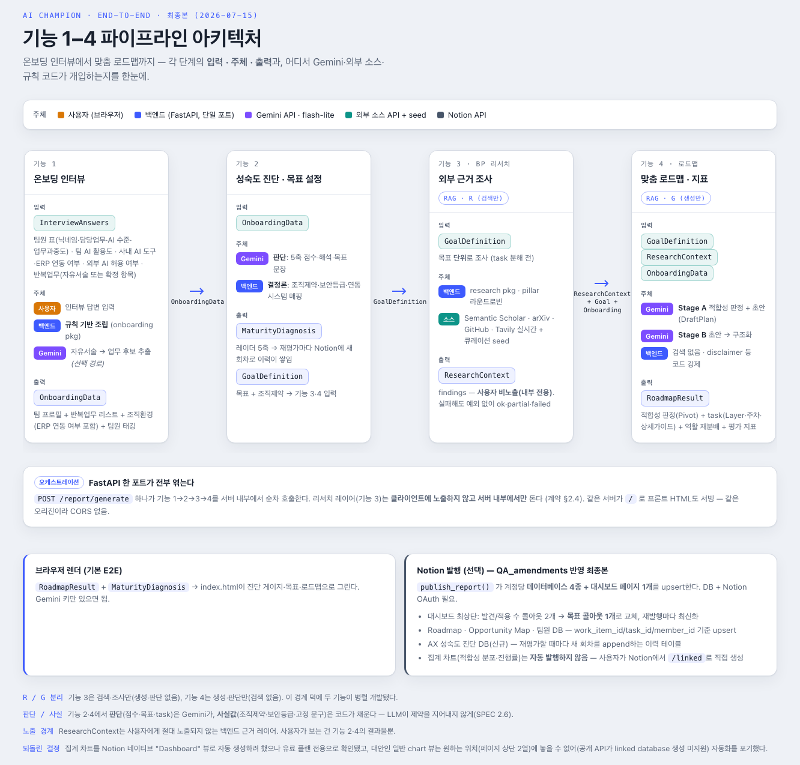

# 26s-w2-c2-06

## 공통과제 II : 협업형 실전 산출물 제작 (2인 1팀)

**목적:** 실시간 인터랙션, LLM Wrapper, Cross-Platform 중 하나의 옵션을 선택해 구현하며, 선택한 기술을 실제로 동작하는 형태의 산출물로 완성한다.

**선택 옵션:**

| 옵션 | 설명 |
|---|---|
| 실시간 인터랙션 | 사용자 간 상태 변화, 실시간 데이터 흐름, 스트리밍 응답 등 실시간성이 드러나는 기능을 구현 |
| LLM Wrapper | LLM API를 활용하여 AI 기능이 포함된 산출물을 구현 |
| Cross-Platform | 하나의 산출물을 여러 실행 환경에서 사용할 수 있도록 구현* |

> *데스크톱 앱 ↔ 모바일 앱; 혹은 다른 폼팩터에서의 앱; 웹만/웹 기반 프레임워크(Electron, Tauri 등) 대신 다른 프레임워크를 시도해보는 것을 적극 권장

**결과물:** 선택한 옵션이 적용된 작동 가능한 산출물, 실행 가능한 코드, 시연 자료 및 관련 문서

---

## 팀원

| 이름 | 학교 | GitHub | 역할 |
|---|---|---|---|
| 임유빈 | 서울대학교 | [@lunar-yoobin](https://github.com/lunar-yoobin) | 온보딩 인터뷰/AX 성숙도 진단 및 목표 설정/BP 리서치 구현, Notion 응답 템플릿 제작 |
| 김경원 | 한양대학교 | [@kkw610](https://github.com/kkw610) | 온보딩 인터뷰 내의 vLLM 학습, 맞춤 로드맵+평가 지표 생성/Notion 자동 발행 구현, 배포 및 인프라 |

---

## 배포

**운영 주소**: https://ai-champion.madcamp-kaist.org

---

## 선택 옵션

- [ ] 실시간 인터랙션
- [x] LLM Wrapper
- [ ] Cross-Platform

---

## 기획안

- **산출물 주제:** AI Champion - AX(AI 전환) 도입 초기 단계의 '개인 중간관리자'를 위한 코칭 어시스턴트
- **제작 목적:** 전사 단위 컨설팅이 아니라, 관리자 한 사람의 의지만으로 자기 팀 단위에서 AI 활용을 시작·실험·검증할 수 있도록 돕는다. AI 만능주의를 경계해 '생성형 AI로 풀 문제가 맞는지'부터 판정하고, 아니라면 대안(자동화 템플릿·현행 유지)을 제안한다.
- **선택 옵션:** LLM Wrapper (Gemini API)
- **핵심 구현 요소**
  1. 온보딩 인터뷰: 업종/팀 규모/AI 활용 수준/조직 환경 + 반복 업무를 자유서술로 받아 LLM이 구조화
  2. AX 성숙도 진단 및 목표 설정: 5축(전략 명확성/도구 활용도/팀 수용력/데이터 접근성/평가 체계) 진단 + 목표 정의서 생성
  3. BP 리서치 엔진: Semantic Scholar·arXiv·GitHub·Tavily 등 다중 소스 실시간 조회(사전 구축 corpus 없음) — 사용자에게 직접 노출되지 않고 4번의 근거로만 쓰임
  4. 맞춤 로드맵 + 평가 지표 생성: AI 적합성 판정(빈도×정형성 매트릭스 + 게이트) → Layer 분류 → task 분해 → 역할 재분배 제안 → 지표 설계, 리서치 출처를 함께 노출
  - 위 산출물을 Notion 워크스페이스(팀원 DB·Opportunity Map DB·Roadmap DB + 진행률/적합성 분포 차트)로 자동 발행
- **사용 / 시연 시나리오:** 관리자가 온보딩 질문(또는 하루 업무 자유서술)에 답변 → LLM이 반복 업무를 구조화 → 5축 성숙도 진단과 목표 문장 생성 → 목표를 근거로 실시간 리서치 → AI 적합성 판정과 함께 이번 주 실행 가능한 로드맵 생성 → 결과를 Notion 대시보드로 발행
- **팀원별 역할:** FE(임유빈) / BE·인프라(김경원)

### 개발 일정

| 날짜 | 목표 |
|---|---|
| Day 1 | 환경 세팅, Gemini API·DB 연동 테스트 |
| Day 2 | 온보딩 인터뷰 + AX 성숙도 진단·목표 설정 구현 |
| Day 3 | BP 리서치 엔진(다중 소스 실시간 조회) 구현 |
| Day 4 | 로드맵 생성(적합성 판정·Layer 분류·역할 재분배·지표) 프롬프트 및 구조화된 출력 설계 |
| Day 5 | Notion 연동(OAuth) 및 결과물 발행, 데모 페이지 연동 |
| Day 6 | 통합 테스트, 안정화(레이트리밋/캐싱/에러 처리) |
| Day 7 | 배포(KCLOUD VM + Cloudflare Tunnel) 및 자동배포 파이프라인 구축, 시연 자료 준비 |

---

## 구현 명세서

| 구현 요소 | 설명 | 우선순위 | 상태 |
|---|---|---|---|
| 1. 온보딩 인터뷰 | 업종/팀 규모/AI 활용 수준/조직 환경 + 반복 업무 자유서술 → LLM이 구조화 | 필수 | ✅ 구현 완료 |
| 2. AX 성숙도 진단 및 목표 설정 | 5축 진단(레이더 차트용) + 목표 정의서 생성 | 필수 | ✅ 구현 완료 |
| 3. BP 리서치 엔진 | Semantic Scholar·arXiv·GitHub·Tavily 다중 소스 실시간 조회, 4번에만 전달(비노출) | 필수 | ✅ 구현 완료 |
| 4. 맞춤 로드맵 + 평가 지표 생성 | AI 적합성 판정(매트릭스+게이트) → Layer 분류 → task 분해 → 역할 재분배 제안 → 지표 설계, 리서치 출처 노출 | 필수 | ✅ 구현 완료 |
| Notion 자동 발행 | 팀원/Opportunity Map/Roadmap DB + 적합성 분포·진행률·AX 적용 현황 차트 자동 생성 | 필수 | ✅ 구현 완료 |

---

## 아키텍처



<!-- LLM Wrapper: API 연동 흐름도 -->

```
사용자 (온보딩 인터뷰 답변)
   │
   ▼
백엔드 API (FastAPI) ─ backend/app/static/index.html (데모 페이지)
   │
   ├─▶ 1. 온보딩(app/onboarding)          — 반복 업무 자유서술 → LLM 구조화
   │
   ├─▶ 2. AX 성숙도 진단·목표(app/diagnosis) — Gemini: 5축 점수 + 목표 문장
   │        (조직 제약은 LLM이 아니라 온보딩 사실값에서 코드가 결정론적으로 채움)
   │
   ├─▶ 3. BP 리서치 엔진(app/research)      — goal_id 캐시 확인
   │        │ miss                          (in-memory, Redis 아님)
   │        ▼
   │    Semantic Scholar / arXiv / GitHub / Tavily 실시간 조회
   │    (pillar 라운드로빈으로 practice/trend/research 다양성 보장)
   │
   ├─▶ 4. 로드맵 생성(app/roadmap) — 2단계 Gemini 호출
   │        Stage A: 적합성 판정(매트릭스+게이트) + Layer 분류 + task 초안
   │        Stage B: 역할 재분배 제안 + 지표 설계 + source_refs 부착
   │
   └─▶ Notion 발행(app/notion) — 팀원/Opportunity Map/Roadmap DB 생성·upsert
            + 적합성 분포·Task별 진행률·AX 적용 현황 차트, 배너/색상 고정
```

- **LLM**: Gemini (`gemini-3.1-flash-lite`, `app/core/config.py`에서 모델명 교체 가능) — 리서치 레이어(3번)는 LLM을 쓰지 않고 규칙 기반으로만 동작
- **DB(PostgreSQL)**: 도메인 데이터(온보딩/로드맵 등)를 저장하지 않는다(요청-응답 파이프라인, 상태 없음) — Notion OAuth 연결 정보·계정별 발행된 워크스페이스/행 ID 추적 용도로만 사용(`app/notion/models.py`)
- **캐시**: 리서치·로드맵 결과 모두 `goal_id` 키의 프로세스 인메모리 캐시(`app/research/cache.py`, `app/roadmap/cache.py`) — docker-compose의 Redis는 현재 인프라만 구성돼 있고 애플리케이션 로직에서는 아직 쓰이지 않음
- **외부 연동**: Gemini API, Notion API(Public Integration + OAuth), Semantic Scholar/arXiv/GitHub/Tavily(리서치)

---

## 설계 문서

> 프로젝트 성격에 따라 필요한 항목만 작성

### 화면 / 인터페이스 설계

<!-- Figma 링크, 화면 이미지, CLI 사용 예시, 앱 화면 등 -->
- 백엔드 내장 데모 페이지(`backend/app/static/index.html`, `/`): 온보딩 입력 폼(칩 선택 + 반복 업무 표) → "리포트 생성" → 5축 진단 게이지·목표·적합성 판정·주차별 로드맵 카드 렌더링 → "Notion에 발행" 버튼으로 실제 워크스페이스에 발행
- Notion 발행 결과: "AX 대시보드" 페이지(발견한 Opportunity 수·적용한 업무 수 콜아웃) + 팀원/Opportunity Map/Roadmap 인라인 데이터베이스 + 차트 뷰(적합성 분포, Task별 진행률, AX 적용 현황)

### 데이터 구조

<!-- DB 스키마, JSON 구조, 파일 저장 방식 등 -->
도메인 데이터는 DB 테이블이 아니라 **Pydantic 계약 스키마**(`backend/app/contracts/`)로 파이프라인 단계 사이를 오간다(요청-응답형, 영속 저장 없음):

- `OnboardingData`(1번 출력·2·4번 입력): 팀 규모/AI 활용 수준/조직 환경/반복 업무 리스트/팀원 태깅
- `MaturityDiagnosis` + `GoalDefinition`(2번 출력·3·4번 입력): 5축 점수, 목표 문장, 조직 제약(허용 도구/보안 수준)
- `ResearchContext`(3번 출력·4번 입력, 비노출): finding 리스트(출처 URL 포함)
- `RoadmapResult`(4번 출력): `FitnessAssessment`(적합성 판정) + `Task`(Layer/카테고리/지표/출처) + `RoleReassignmentSuggestion` + `Metric`

실제 PostgreSQL 테이블은 Notion 연동 상태 추적용뿐이다(`backend/app/notion/models.py`):

```python
NotionConnection      # 계정별 OAuth 토큰 (account_id PK)
NotionWorkspace        # 계정별 발행된 팀원/Opportunity Map/Roadmap DB + 대시보드 ID
NotionMemberPage       # 팀원 DB 행 (account_id, member_id) -> Notion page_id
NotionWorkItemPage     # Opportunity Map DB 행 (account_id, goal_id, work_item_id) -> page_id
NotionTaskPage         # Roadmap DB 행 (account_id, goal_id, task_id) -> page_id
```

### API / 외부 서비스 연동

| Method | Endpoint | 설명 | 비고 |
|---|---|---|---|
| GET | `/onboarding/interview` | 인터뷰 질문 대본 반환 | 기능 1 |
| POST | `/onboarding/extract-tasks` | 하루 업무 자유서술 → 반복 업무 후보 | Gemini 호출 |
| POST | `/onboarding/submit` | 인터뷰 답변 → `OnboardingData` | - |
| POST | `/diagnosis/diagnose` | `OnboardingData` → 성숙도 진단 + 목표 정의서 | Gemini 호출, 기능 2 |
| POST | `/diagnosis/publish-report` | 진단(+로드맵)을 Notion에 발행 | - |
| POST | `/diagnosis/generate-and-publish` | 온보딩→진단→리서치→로드맵→Notion 발행 전체 | 1→2→3→4 통합 |
| POST | `/roadmap/generate` | 목표+온보딩 → 로드맵 생성 | 기능 3(내부)+4 |
| POST | `/roadmap/publish` | 로드맵 → Notion 발행 | - |
| POST | `/roadmap/generate-and-publish` | 로드맵 생성+발행 한 번에 | - |
| POST | `/roadmap/{account_id}/refresh-progress` | Notion 대시보드 집계 콜아웃 새로고침 | 수동 호출 |
| POST | `/report/generate` | 온보딩 답변 → 진단+로드맵 JSON (Notion 발행 없음, 데모용) | 리서치 레이어 비노출 |
| GET | `/notion/connect`, `/notion/callback` | Notion OAuth 연결 플로우 | Public Integration |
| GET | `/notion/status`, `DELETE /notion/connection` | 연결 상태 확인 / 연결 해제(워크스페이스 전환용) | - |
| Google `google-genai` SDK | Gemini API | 구조화 출력(JSON) 생성 | `response_schema`로 Pydantic 모델 직접 지정 |
| REST (httpx) | Semantic Scholar / arXiv / GitHub / Tavily | BP 리서치 실시간 조회 | 무료 티어, 각각 독립 실패 허용 |
| REST (httpx) | Notion API (2026-03-11) | 데이터베이스·페이지·뷰(차트) 생성/갱신 | 공식 SDK 미사용, 직접 REST 호출 |

---

## 산출물 및 실행 방법

- **산출물 설명:** 온보딩 인터뷰 → AX 성숙도 진단·목표 설정 → BP 리서치(다중 소스 실시간 조회) → 적합성 판정 포함 맞춤 로드맵 생성 → Notion 워크스페이스 자동 발행까지 이어지는 FastAPI 백엔드. 브라우저 데모 페이지(`/`)에서 온보딩부터 Notion 발행까지 전 과정을 바로 체험 가능.
- **실행 환경:** Python 3.11, Docker / docker-compose (PostgreSQL 16 + Redis 포함), Gemini API 키·Notion OAuth 앱 필요
- **실행 방법:** 아래 '방법 A/B' 참고. 운영 배포본은 https://ai-champion.madcamp-kaist.org (배포 섹션 참고)
- **시연 영상 / 이미지:** (선택)

**방법 A. docker-compose로 전체 스택 실행 (권장 — 팀원 간 동일 환경 보장)**

```bash
cd backend
cp .env.example .env   # 필요한 키(GEMINI_API_KEY 등) 채우기

docker compose up --build
# app: http://localhost:8000  (DB/Redis는 컨테이너 내부에서 자동 연결됨)
# 컨테이너 기동 시 alembic 마이그레이션 자동 적용
```

**방법 B. 로컬(uv)로 백엔드만 직접 실행**

```bash
cd backend

# 의존성 설치 (uv 사용, 또는 pip install -r requirements.txt)
uv sync

cp .env.example .env   # DATABASE_URL/REDIS_URL을 로컬에 맞게 조정

# DB/Redis는 직접 띄우거나 docker compose up db redis 로 그 두 개만 기동
uv run alembic upgrade head
uv run uvicorn app.main:app --reload

# 테스트
uv run pytest
```

### 기술 구성

| 분류 | 사용 기술 |
|---|---|
| 핵심 기술 | FastAPI, Pydantic v2 |
| 실행 환경 | Python 3.11, uv (패키지 매니저), Docker / docker-compose |
| 데이터 저장 | PostgreSQL 16(`pgvector/pgvector` 이미지 사용하나 벡터 기능은 미사용, Notion 연동 상태 추적 전용) + SQLAlchemy + Alembic. Redis는 인프라만 구성, 로직에서는 미사용 |
| 외부 API / 서비스 | Gemini API(`google-genai`), Notion API(Public Integration OAuth), Semantic Scholar / arXiv / GitHub / Tavily(BP 리서치) |
| 배포 / 인프라 | KCLOUD VM + Docker, Cloudflare Tunnel(DNS 셀프서비스 API로 서브도메인·터널 발급), systemd 타이머 기반 폴링 자동 배포, GitHub Actions(테스트 CI) |
| 기타 | 학교 ML 서버(GPU, KCLOUD) — 파인튜닝 실험용(스프린트1 범위 밖), KCLOUD VPN 필요 |

---

## 회고 문서

> [KPT 방법론 참고](https://velog.io/@habwa/%EB%8B%A8%EA%B8%B0-%ED%94%84%EB%A1%9C%EC%A0%9D%ED%8A%B8-%ED%9A%8C%EA%B3%A0-KPT-%EB%B0%A9%EB%B2%95%EB%A1%A0)

### Keep — 잘 된 점, 다음에도 유지할 것

- 막히는 부분이 생기면 바로 공유하고 함께 원인을 추적한 것. 노션 발행 중 발생한 502 에러, "archived ancestor" 오류처럼 같은 유형의 장애가 여러 번 반복됐을 때도 증상만 덮지 않고 매번 실제 원인(Cloudflare의 502/504 응답 마스킹, 트래시된 노션 페이지 재사용 등)까지 함께 추적해 고쳤다.
- 4개 핵심 기능을 Pydantic 계약 스키마(`OnboardingData`/`GoalDefinition`/`ResearchContext`/`RoadmapResult`)로 먼저 고정하고, 리서치(R)와 로드맵 생성(G)의 책임을 "검색만/생성만"으로 딱 갈라둔 덕분에 두 사람이 서로 막히지 않고 병렬로 개발할 수 있었다.
- SPEC.md(정책 합의) · 스프린트 문서(구현) · QA_amendments(수정 제안)를 역할별로 분리해 기록하는 습관 덕분에, 왜 이렇게 만들었는지가 나중에도 코드/문서만 보고 추적 가능했다.
- Notion Dashboard 뷰가 유료 플랜 전용이라는 걸 뒤늦게 발견했을 때, 억지로 흉내내지 않고 자동화를 포기한 이유를 모듈 docstring에 그대로 남겨서 같은 삽질을 반복하지 않도록 했다.

### Problem — 아쉬웠던 점, 개선이 필요한 것

- 코드 구조화가 충분하지 않았다. 노션 발행 로직(`app/notion/sync.py`)을 기능 단위로 빠르게 얹다 보니 워크스페이스 생성·속성 upsert·차트 설정까지 한 파일에 몰려 책임이 뒤섞였고, 이후 스키마가 바뀔 때마다 어디를 고쳐야 할지 찾는 비용이 커졌다.
- docker-compose에 Redis·pgvector까지 구성해놓고 실제로는 인메모리 캐시와 노션 연결 추적용 테이블 몇 개만 썼다 — 인프라 설계와 실제 사용 범위 사이 괴리가 컸다.
- 도메인 데이터(온보딩 답변, 로드맵 결과)를 전혀 영속화하지 않는 요청-응답형 구조라, 새로고침하면 생성된 로드맵이 그대로 날아간다 — 데모에는 충분했지만 실사용성은 떨어진다.
- 데모 페이지(index.html 단일 파일)로 프론트를 때웠기 때문에, 백엔드 로직이 다 완성된 뒤에도 사용자가 보는 화면을 다듬을 시간이 부족했다.

### Try — 다음번에 시도해볼 것

- 같은 유형의 장애가 두 번째로 반복되는 순간 바로 근본 원인을 고치는 습관을 들인다. 세 번째까지 기다리지 않는다.
- Claude Code 같은 AI 코딩 에이전트에게 배포·인프라 작업을 맡길 때는 커밋/푸시 시점을 사람이 항상 직접 확인·승인하는 것을 원칙으로 삼는다. 이번에도 자동 배포 파이프라인을 구축하는 과정에서 이 원칙이 필요하다는 걸 깨닫고 세션 중간부터 적용했는데, 다음 프로젝트에는 처음부터 못박아두고 싶다.
- 외부 API(Notion Dashboard 뷰, 플랜별 제약 등)의 한계를 기능 설계 전에 먼저 짧게 스파이크해서, 설계가 끝난 뒤에 "안 되는 걸 알게 되는" 순서를 뒤집는다.
- 온보딩·로드맵 같은 핵심 산출물만이라도 최소한으로 영속 저장해서, 새로고침·재방문 시에도 이전 결과를 복원할 수 있게 한다.
- 인메모리 캐시를 이미 구성해둔 Redis로 옮겨 프로세스 재시작에도 리서치/로드맵 캐시가 유지되도록 한다.
- 노션 발행까지 이어지는 E2E 플로우를 자동화된 회귀 테스트로 커버한다. 지금은 단위 테스트는 탄탄하지만, 노션 스키마가 바뀔 때마다 전체 플로우를 수동으로 재현해서 확인해야 했다.

### 팀원별 소감

**임유빈:**

> 

**김경원:**

> AX라는 주제 자체를 이번에 처음 접했는데, 막연했던 개념을 실제로 동작하는 서비스로 옮기려니 예상보다 어려운 지점이 많았다.
온보딩 인터뷰용 모델 학습부터 로드맵 생성, 노션 자동 발행, 배포까지 맡은 부분을 끝까지 붙잡고 가다 보니 막히는 순간도 잦았지만, 그만큼 끝나고 나니 확실히 남는 게 있는 한 주였다.

---

## 참고 자료

### 실시간 인터랙션

**WebSocket**
- https://developer.mozilla.org/en-US/docs/Web/API/WebSockets_API
- https://techblog.woowahan.com/5268/
- https://tech.kakao.com/posts/391
- https://daleseo.com/websocket/
- https://kakaoentertainment-tech.tistory.com/110

**Socket.IO**
- https://socket.io/docs/v4/
- https://inpa.tistory.com/entry/SOCKET-%F0%9F%93%9A-Namespace-Room-%EA%B8%B0%EB%8A%A5
- https://adjh54.tistory.com/549
- https://fred16157.github.io/node.js/nodejs-socketio-communication-room-and-namespace/

**SSE (Server-Sent Events)**
- https://developer.mozilla.org/en-US/docs/Web/API/Server-sent_events
- https://developer.mozilla.org/ko/docs/Web/API/Server-sent_events/Using_server-sent_events
- https://api7.ai/ko/blog/what-is-sse

**TCP / UDP Socket**
- https://docs.python.org/3/library/socket.html
- https://inpa.tistory.com/entry/NW-%F0%9F%8C%90-%EC%95%84%EC%A7%81%EB%8F%84-%EB%AA%A8%ED%98%B8%ED%95%9C-TCP-UDP-%EA%B0%9C%EB%85%90-%E2%9D%93-%EC%89%BD%EA%B2%8C-%EC%9D%B4%ED%95%B4%ED%95%98%EC%9E%90

**gRPC Streaming**
- https://grpc.io/docs/what-is-grpc/core-concepts/
- https://tech.ktcloud.com/entry/gRPC%EC%9D%98-%EB%82%B4%EB%B6%80-%EA%B5%AC%EC%A1%B0-%ED%8C%8C%ED%97%A4%EC%B9%98%EA%B8%B0-HTTP2-Protobuf-%EA%B7%B8%EB%A6%AC%EA%B3%A0-%EC%8A%A4%ED%8A%B8%EB%A6%AC%EB%B0%8D
- https://tech.ktcloud.com/entry/gRPC%EC%9D%98-%EB%82%B4%EB%B6%80-%EA%B5%AC%EC%A1%B0-%ED%8C%8C%ED%97%A4%EC%B9%98%EA%B8%B02-Channel-Stub
- https://inspirit941.tistory.com/371
- https://devocean.sk.com/blog/techBoardDetail.do?ID=167433

**WebRTC**
- https://developer.mozilla.org/en-US/docs/Web/API/WebRTC_API
- https://webrtc.org/getting-started/overview
- https://web.dev/articles/webrtc-basics?hl=ko
- https://devocean.sk.com/blog/techBoardDetail.do?ID=164885
- https://beomkey-nkb.github.io/%EA%B0%9C%EB%85%90%EC%A0%95%EB%A6%AC/webRTC%EC%A0%95%EB%A6%AC/
- https://gh402.tistory.com/45
- https://on.com2us.com/tech/webrtc-coturn-turn-stun-server-setup-guide/

**QUIC / WebTransport**
- https://developer.mozilla.org/en-US/docs/Web/API/WebTransport_API
- https://datatracker.ietf.org/doc/html/rfc9000
- https://news.hada.io/topic?id=13888

#### KCLOUD VM / Cloudflare Tunnel 환경별 주의사항

| 환경 | 사용 가능(권장) 기술 | 포트/조건 | 주의할 기술 |
|---|---|---|---|
| **로컬 / 일반 VM** | HTTP/REST, WebSocket, Socket.IO, SSE, TCP Socket, gRPC Streaming, WebRTC, QUIC/WebTransport 등 대부분 가능 | 직접 포트 개방 가능. 예: 3000, 5000, 8000, 8080, 9000 등. 외부 공개 시 방화벽/보안그룹/공인 IP 설정 필요 | WebRTC는 STUN/TURN 필요 가능. QUIC/WebTransport는 HTTP/3 · UDP 지원 필요 |
| **KCLOUD VM (VPN 내부)** | HTTP/REST, WebSocket, Socket.IO, SSE, WebRTC 시그널링 | 접속 기기 VPN 필요. 기본 허용 포트: **22, 80, 443**. 개발 포트(3000, 8000, 8080 등)는 직접 접근 제한 가능 | TCP Socket은 포트 제한 있음. gRPC는 HTTP/2 설정 필요. WebRTC 미디어·UDP·QUIC/WebTransport 비권장 |
| **KCLOUD VM + Tunnel** | HTTP/REST, WebSocket, Socket.IO, SSE, WebRTC 시그널링 | VM의 `localhost:<port>`를 도메인에 연결. `localPort`는 **1024~65535**. 예: 3000, 8000, 8080 가능 | 순수 TCP Socket, UDP, WebRTC 미디어/DataChannel, QUIC/WebTransport 불가. gRPC 보장 어려움 |
| **외부 서비스 + 우리 도메인** | HTTP/REST, WebSocket, Socket.IO, SSE, WebRTC 시그널링 | Vercel/Netlify/Railway/Render/AWS/GCP 등에 배포 후 CNAME/A 레코드 연결. 보통 외부는 **443** 사용 | WebSocket/gRPC/TCP/UDP는 플랫폼 지원 여부 확인 필요. 서버리스 플랫폼은 장시간 연결 제한 가능 |
| **서버 없이 외부 SaaS 사용** | Supabase Realtime, Firebase, Pusher/Ably, LLM API Streaming | 직접 포트 관리 불필요. 각 서비스 SDK/API 사용 | 커스텀 TCP/UDP 서버 구현 불가. WebRTC는 STUN/TURN 필요할 수 있음 |

### LLM Wrapper

- https://github.com/teddylee777/openai-api-kr
- https://github.com/teddylee777/langchain-kr
- https://devocean.sk.com/blog/techBoardDetail.do?ID=167407
- https://mastra.ai/docs

### Cross-Platform

- https://flutter.dev/
- https://reactnative.dev/
- https://docs.expo.dev/
- https://kotlinlang.org/multiplatform/
